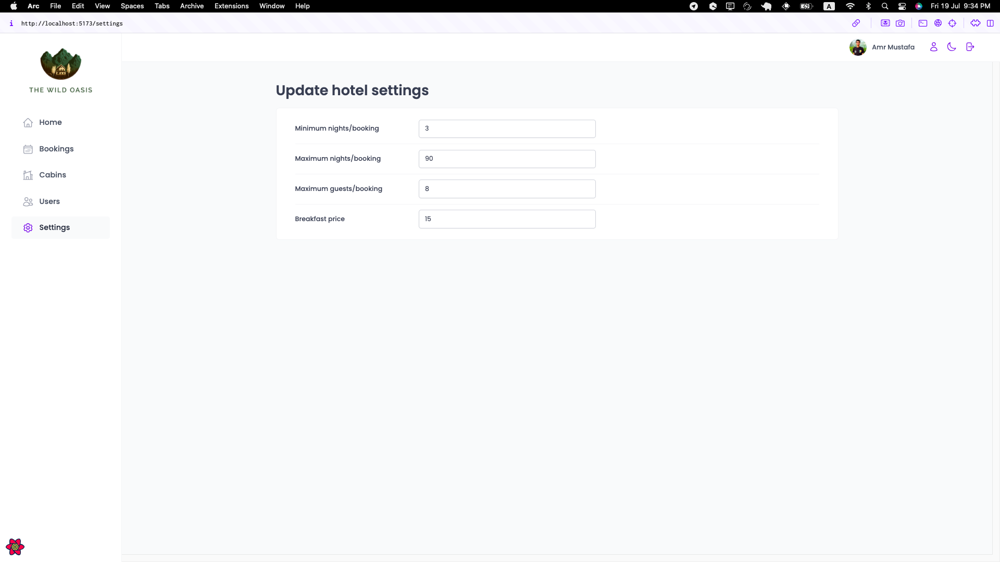

# The-Wild-Oasis

This repository contains the source code for a hotel management application developed as application for Jonas React course. The application allows employee manage customers actions like chick-in/out, manage cabins create or update existing one, add new emplyess as system users, and discover all stats and statistics of the hotel.

## Key Features

- **Authentication & Authorization**: Sign-in, upload profile image and upadte your data.
- **Explore Statistics**: see all states like bookings, sales, chick-ins, occupancy rate , and more in charts.
- **Manage Bookings**: check-in bookings , see its details, or delete them.
- **Manage Cabins**: Create new cabin, dublicate / edit / delete existing one.
- **Manage Users**: Sign-up new users as employees to give them access to login.
- **Settings**: Set-up some constraints like [Minimum nights/booking - Maximum nights/booking - Maximum guests/booking - Breakfast price].
- **Profile**: manage full-name, avatar image, password.

## Tech Stack

- **Back-end**: Supabase for robust back-end support.
- **Front-end**: React for Client-Side Rendering (CSR).
- **Tools**: 
  - **styled-components**: for styling and write css in the same file
  - **recharts**: for beautifully designed charts
  - **react-hook-form**: to manage forms and validation
  - **react-hot-toast**: to add beautiful notifications to confirm actions
  - **react-error-boundary**: to manage unexpected errors
  - **date-fns**: provide some good date functions

## Getting Started

1. **Clone the repository**: `git clone https://github.com/AmrMustafa282/the-wild-oasis`
2. **Install dependencies**: `npm install`
3. **Start the development server**: `npm run dev`
4. **Open the application**: Visit `http://localhost:3000` in your browser.

## Contributing

Contributions are welcome! If you'd like to contribute to this project, please follow these steps:

1. Fork the repository
2. Create your feature branch (`git checkout -b feature/YourFeature`)
3. Commit your changes (`git commit -am 'Add some feature'`)
4. Push to the branch (`git push origin feature/YourFeature`)
5. Open a pull request

## License

This project is licensed under the MIT License - see the [MTI](LICENSE) file for details.

## Acknowledgements

- This project was developed as part application on @jonasschmedtmann react course.
- Special thanks to the contributors and maintainers of the technologies used in this project.

Feel free to reach out with any questions or feedback!
